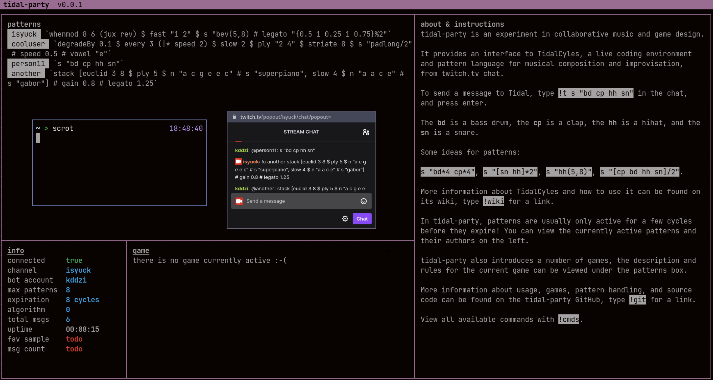

# tidal-party

tidal-party is an experiment in collaborative music and game design.

tidal-party provides a interface to [TidalCycles](https://tidalcycles.org/Welcome) from twitch.tv chat, allowing large numbers of users to send patterns to a remote Tidal instance. It also exposes moderator-level commands to algorithmically manipulate how patterns get added and removed. _(Work in progress)_

It's a great way for a group of people to start learning Tidal without having to install anything (other than a web browser!). Once the host is up and running, all you have to do is send folks a twitch.tv link and you're good to go.

Patterns get passed almost 1:1 between twitch and Tidal, so whatever works in Tidal will (in theory) work from a twitch message.

| Twitch Message                     | Tidal Equivalent                     |
| ---------------------------------- | ------------------------------------ |
| `!t s "bd cp sn hh"`               | `d1 $ s "bd cp sn hh"`               |
| `!t s "psr*4" # speed "<1 2 3 4>"` | `d1 $ s "psr*4" # speed "<1 2 3 4>"` |

In practice, you can think of `!t x` as shorthand for Tidal's `d1 $ x`.

Patterns are kept on a time based stack and are associated with users. There is a (configurable, maybe one day dynamic?) maximum number of patterns that can be active at any one time. When a user sends a new pattern to the chat, their currently active (old) pattern will be replaced by their new pattern. If they don't have any active patterns, the _oldest_ pattern on the stack will be replaced, regardless of who it belonged to. As new patterns replace old patterns, new groups of patterns will form over time.

tidal-party doesn't intend to be a twitch based [estuary](https://github.com/dktr0/estuary), [troop](https://github.com/Qirky/Troop), or [flok](https://github.com/munshkr/flok). All of these are better alternatives for collaborative live coding in smaller groups. Streaming on twitch incurs a 10-30 second delay between sending a pattern and hearing it's result. With enough active users, by the time you hear your pattern it may already have been replaced by a new one from someone else. tidal-party aims to explore emergent music in a group context, while also creating a game-like experience using Tidal as the mechanic.

---

### Notes

- Some of Tidal's more recent bus effects will not work due to the way orbits are handled internally
- You can use tidal-party with either GHCi or [safe-tidal-cli](https://github.com/jwaldmann/safe-tidal-cli). It is **_strongly_** recommended to use [safe-tidal-cli](https://github.com/jwaldmann/safe-tidal-cli) to prevent possible remote code exection, users calling `:q` on GHCi, and so on. Please be aware of the risks.
- This is a new project, and you'll probably find a way to break it! If/when you do, please let us know by opening an issue. 💖

---

### Requirements

tidal-party should work on all major OS's. You will need, in no particular order:

- A twitch channel to stream to
- A _seperate_ account for tidal-party to use as a bot
- People who want to make music
- [node.js](https://nodejs.org/en/)
- [TidalCycles](https://tidalcycles.org/Welcome)
- [SuperCollider](https://supercollider.github.io/)

A full guide for installing Tidal and SuperCollider can be found [here](https://tidalcycles.org/Installation).

---

### Install

Once you've met the requirements above, you can download tidal-party by opening a terminal and running:

`git clone https://github.com/isyuck/tidal-party.git`

Again from a terminal, enter the tidal-party directory by running:

`cd tidal-party`

After this you have to install the packages tidal-party uses. Do this by running:

`npm install`

---

### Config

Next, you need to configure tidal-party to use your channel and bot account. Replace `username` and `password` in `config/config.js` to
the username and password/OAUTH of your bot account. Then change `channels` to the channel name of the _different_ account
hosting the stream. You can also change `maxActivePatterns` if you want to have more/less patterns active at once.

---

### Running tidal-party

_Tidal related tutorials can be found on the [Tidal wiki](https://tidalcycles.org/Userbase)._

Finally, you can start streaming! To get everything started:

- Run tidal-party from a terminal: `npm start`.
- Start SuperCollider and SuperDirt.
- Test it by sending a `!t s "bd cp"` in your twitch chat (you don't have to be live to do this)

If everything is working correctly, you should hear a clap and a kick drum on the host's machine.

After this you can start streaming the audio from SuperCollider to your twitch channel, for this we recommend [OBS](https://obsproject.com/).

---

### Game Design _(Work in progress)_

By default, each pattern gets added with the transition `jumpIn'`. This pattern gets added at the beginning of the next cycle.

You can make patterns expire by typing in the chat `!expire *x*` where x is the number of cycles the pattern lasts. This uses the `mortal` transition from Tidal. You can find a `expiration` parameter in `config/config.js`.
Typing in `!expire 0` will revert this functionality to the original `jumpIn'` transition.

To join a group, type !group `groupname`. Your group name may not contain spaces, nor can you be in multiple groups at the same time. But of course, you can edit any of these parameters in script to your liking :)
